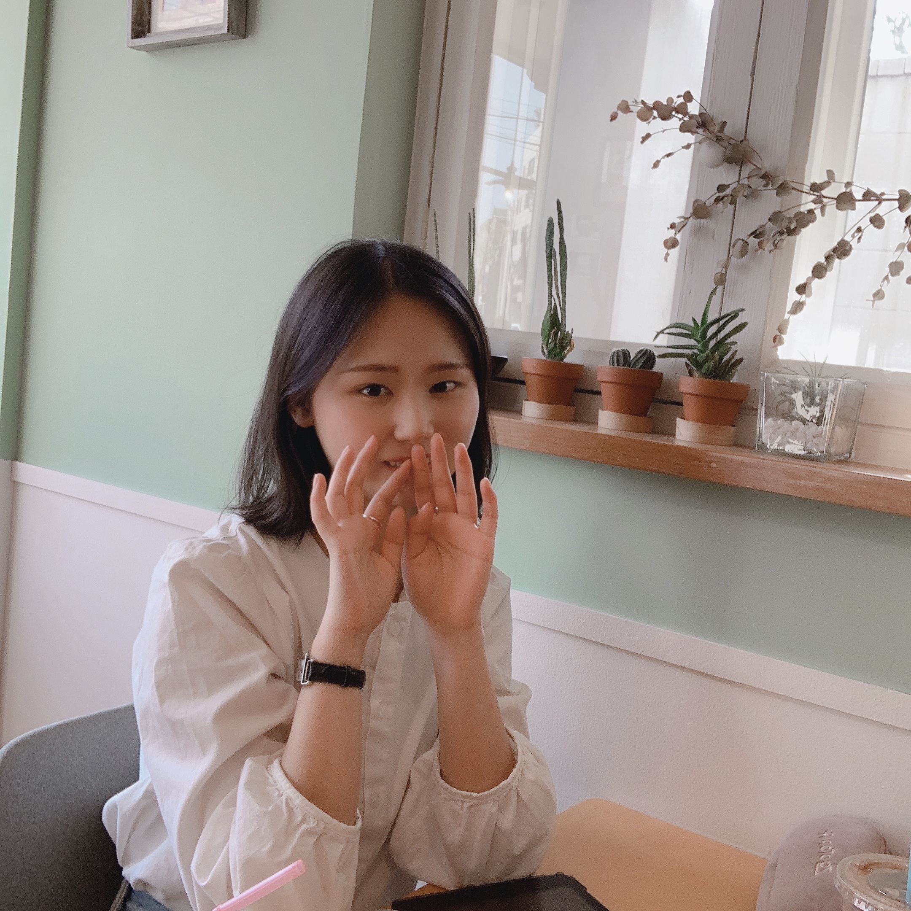

# 멋쟁이 토마토 토마토 🍅

 

안녕하세요 멋쟁이 안드로이드 개발자가 되고 싶은 김예지입니다 :)
누구나 사용할 수 있고 삶의 질을 향상시키는 프로그램을 만드는 개발자를 꿈꾸고 있습니다.

서울과학기술대학교 컴퓨터공학과에 재학하고 있습니다.
뜨개질과 요가가 취미입니다.

   
## Career 👩🏻‍💻
2021.03 ~ 2021.06  넛지 헬스케어 구)캐시워크 안드로이드팀 인턴

## Certificate 📝
- TOEIC 885
- OPic IH
- 한국사능력검정 1급
- 정보처리기사 필기 합격

***

### WIP
- 정리중입니다 :)
https://www.notion.so/1463b6bd0a1e47999b98be602bc41508
